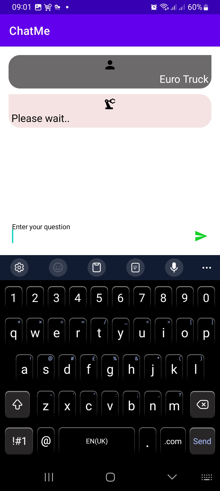

# ChatMe
##Consuming Chat-GPT API on Android using Volley Library

 

 

## Screenshots
    

  

 
# Built With

* [Kotlin](https://kotlinlang.org)
* [Volley Library](https://google.github.io/volley/)
* [Material Design](https://m2.material.io/develop/android)
* [View Binding](https://developer.android.com/topic/libraries/view-binding)
* [Clean Architecture](https://www.raywenderlich.com/3595916-clean-architecture-tutorial-for-android-getting-started)

 
#References
* [Documentation](https://openai.com/blog/introducing-chatgpt-and-whisper-apis)
* [Generate API Key](https://platform.openai.com/account/api-keys)
* [Tutorial](https://www.geeksforgeeks.org/how-to-build-a-chatgpt-like-app-in-android-using-openai-api/)

 
##Clips
 <video width="320" height="240" controls>
  <source src="assets/clip1.mp4" type="video/mp4">
 
  Your browser does not support the video tag.
</video> 
<video width="320" height="240" controls>
  <source src="assets/clip2.mp4" type="video/mp4">
 
  Your browser does not support the video tag.
</video> 

